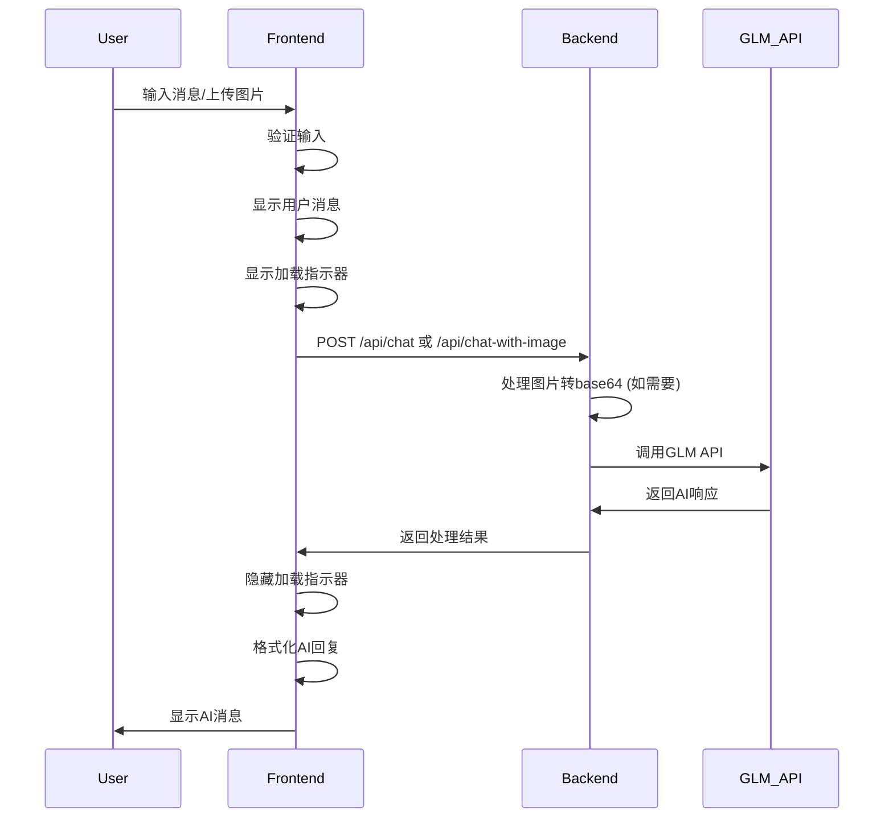
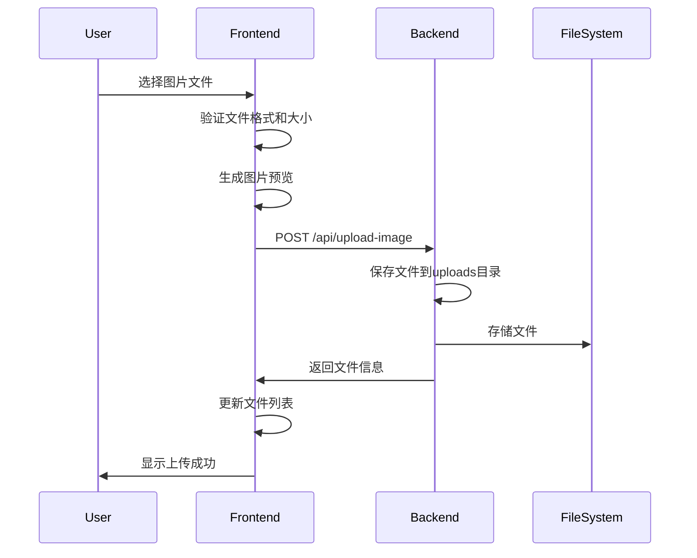

# AI对话模块设计文档

## Architecture Overview

AI对话模块采用前后端分离架构，前端负责用户交互和界面显示，后端处理AI API调用和文件管理。模块化设计确保功能清晰、易于维护和扩展。

## Component Architecture

### Frontend Components

#### ChatManager Class
核心对话管理器，负责对话流程控制和状态管理。

```javascript
class ChatManager {
  constructor() {
    this.currentChatId = null;
    this.chats = [];
    this.currentModel = 'glm-4v';
    this.isGenerating = false;
    this.currentAbortController = null;
  }

  // Core Methods
  async sendMessage(message, imageData)
  createNewChat()
  loadChat(chatId)
  clearCurrentChat()
  exportChat(chatId)

  // State Management
  saveChatsToStorage()
  loadChatsFromStorage()
  updateChatTitle(chatId, title)
}
```

#### MessageRenderer Class
消息渲染器，负责格式化和显示AI回复内容。

```javascript
class MessageRenderer {
  // Content Processing
  renderMarkdown(content)
  highlightCodeBlocks(content)
  formatLinks(content)

  // UI Updates
  appendUserMessage(message)
  appendAssistantMessage(content, metadata)
  showTypingIndicator()
  hideTypingIndicator()

  // Special Features
  copyCodeBlock(button)
  renderImageMessage(imageUrl, caption)
}
```

#### ModelManager Class
AI模型管理器，处理模型选择和配置。

```javascript
class ModelManager {
  constructor() {
    this.models = {
      'glm-4': { name: 'GLM-4', type: 'text', description: '基础对话模型' },
      'glm-4v': { name: 'GLM-4 Vision', type: 'vision', description: '视觉理解模型' },
      'glm-4-plus': { name: 'GLM-4 Plus', type: 'text', description: '增强对话模型' },
      'glm-4v-plus': { name: 'GLM-4V Plus', type: 'vision', description: '增强视觉模型' }
    };
  }

  // Model Operations
  async testModel(modelId)
  switchModel(modelId)
  getCurrentModel()
  getAvailableModels()
  saveModelPreference(modelId)
}
```

#### FileUploadManager Class
文件上传管理器，处理图片上传和预览。

```javascript
class FileUploadManager {
  constructor() {
    this.uploadedFiles = [];
    this.maxFileSize = 10 * 1024 * 1024; // 10MB
    this.allowedTypes = ['image/jpeg', 'image/jpg', 'image/png', 'image/gif', 'image/webp'];
  }

  // File Operations
  async uploadFile(file)
  validateFile(file)
  generatePreview(file)
  removeFile(fileId)

  // Backend Integration
  async uploadToBackend(file)
  getUploadedFilesList()
  deleteFile(filename)
}
```

### Backend API Design

#### Endpoints Structure
```javascript
// Server Routes Configuration
app.post('/api/chat', handleTextChat)           // 文本对话
app.post('/api/chat-with-image', handleImageChat) // 图像对话
app.post('/api/upload-image', handleImageUpload)  // 图片上传
app.get('/api/uploads', getUploadedFiles)        // 获取文件列表
app.delete('/api/upload/:filename', deleteFile)   // 删除文件
app.get('/health', healthCheck)                   // 健康检查
```

#### API Response Format
```javascript
// Success Response
{
  success: true,
  message: "操作成功",
  response: "AI回复内容",
  model: "glm-4v",
  usage: {
    prompt_tokens: 100,
    completion_tokens: 200,
    total_tokens: 300
  }
}

// Error Response
{
  success: false,
  error: "错误类型",
  details: "详细错误信息"
}
```

## State Management

### Application State
```javascript
const appState = {
  // Authentication
  currentUser: null,
  isLoggedIn: false,

  // Chat Management
  currentChatId: null,
  chats: [],
  isGenerating: false,

  // Model Configuration
  currentModel: 'glm-4v',
  availableModels: {},
  modelStatus: {},

  // UI State
  sidebarOpen: true,
  theme: 'light',
  deepThinking: false,

  // File Management
  uploadedFiles: [],
  currentImage: null,

  // Settings
  autoSave: true,
  exportFormat: 'markdown',
  voiceEnabled: false
};
```

### State Persistence
```javascript
// localStorage Structure
{
  "chats": [
    {
      id: "chat_1640995200000",
      title: "数学问题讨论",
      messages: [...],
      createdAt: "2023-12-31T16:00:00.000Z",
      updatedAt: "2024-01-01T10:30:00.000Z"
    }
  ],
  "settings": {
    currentModel: "glm-4v",
    theme: "light",
    deepThinking: false,
    autoSave: true
  },
  "uploadedFiles": [
    {
      filename: "math-problem-123.jpg",
      url: "/uploads/math-problem-123.jpg",
      size: 1024000,
      uploadTime: "2024-01-01T10:30:00.000Z"
    }
  ]
}
```

## Data Flow

### Message Sending Flow


### File Upload Flow


## Error Handling Strategy

### Error Categories
1. **Network Errors**: 连接超时、网络中断
2. **API Errors**: GLM API调用失败、配额不足
3. **Validation Errors**: 输入格式错误、文件格式不支持
4. **Storage Errors**: localStorage空间不足、读写失败
5. **UI Errors**: 渲染失败、组件加载错误

### Error Recovery Mechanisms
```javascript
class ErrorHandler {
  static handle(error, context) {
    console.error(`Error in ${context}:`, error);

    // Network Errors
    if (error.name === 'TypeError' || error.message.includes('fetch')) {
      return this.showNetworkError();
    }

    // API Errors
    if (error.status >= 400) {
      return this.showAPIError(error);
    }

    // Validation Errors
    if (error.name === 'ValidationError') {
      return this.showValidationError(error);
    }

    // Default Error
    return this.showGenericError();
  }

  static showNetworkError() {
    return {
      type: 'error',
      message: '网络连接失败，请检查网络设置后重试',
      action: 'retry'
    };
  }

  static showAPIError(error) {
    const messages = {
      429: 'API调用过于频繁，请稍后重试',
      500: '服务器内部错误，请稍后重试',
      401: 'API密钥无效，请联系管理员'
    };

    return {
      type: 'error',
      message: messages[error.status] || 'API调用失败',
      details: error.statusText
    };
  }
}
```

## Performance Optimization

### Frontend Optimizations
1. **Virtual Scrolling**: 大量消息时使用虚拟滚动
2. **Image Lazy Loading**: 图片按需加载
3. **Code Splitting**: 组件按需加载
4. **Request Debouncing**: 防止重复请求
5. **Memory Management**: 及时清理无用对象

### Backend Optimizations
1. **File Compression**: 图片自动压缩
2. **Response Caching**: 缓存常用响应
3. **Rate Limiting**: API调用频率限制
4. **Connection Pooling**: 复用HTTP连接
5. **Error Monitoring**: 实时错误监控

### Code Examples
```javascript
// Virtual Scrolling Implementation
class VirtualScroller {
  constructor(container, itemHeight, renderItem) {
    this.container = container;
    this.itemHeight = itemHeight;
    this.renderItem = renderItem;
    this.visibleItems = Math.ceil(container.clientHeight / itemHeight) + 2;
    this.scrollTop = 0;

    this.setupScrollListener();
  }

  render(items) {
    const startIndex = Math.floor(this.scrollTop / this.itemHeight);
    const endIndex = Math.min(startIndex + this.visibleItems, items.length);

    // Clear container
    this.container.innerHTML = '';

    // Render visible items
    for (let i = startIndex; i < endIndex; i++) {
      const item = this.renderItem(items[i], i);
      item.style.position = 'absolute';
      item.style.top = `${i * this.itemHeight}px`;
      this.container.appendChild(item);
    }

    // Update container height
    this.container.style.height = `${items.length * this.itemHeight}px`;
  }
}

// Request Debouncing
class Debouncer {
  constructor(delay = 300) {
    this.delay = delay;
    this.timeouts = new Map();
  }

  debounce(key, callback) {
    if (this.timeouts.has(key)) {
      clearTimeout(this.timeouts.get(key));
    }

    const timeout = setTimeout(() => {
      callback();
      this.timeouts.delete(key);
    }, this.delay);

    this.timeouts.set(key, timeout);
  }
}
```

## Security Considerations

### Client-Side Security
1. **Input Sanitization**: 所有用户输入进行清理
2. **XSS Prevention**: 防止跨站脚本攻击
3. **CSRF Protection**: 跨站请求伪造防护
4. **Content Security Policy**: 内容安全策略

### Server-Side Security
1. **File Validation**: 严格的文件类型和大小验证
2. **API Key Protection**: 安全的API密钥管理
3. **Rate Limiting**: API调用频率限制
4. **Error Information**: 避免泄露敏感错误信息

### Security Examples
```javascript
// Input Sanitization
class InputSanitizer {
  static sanitizeHTML(input) {
    const div = document.createElement('div');
    div.textContent = input;
    return div.innerHTML;
  }

  static sanitizeMarkdown(input) {
    // Basic markdown sanitization
    return input
      .replace(/<script\b[^<]*(?:(?!<\/script>)<[^<]*)*<\/script>/gi, '')
      .replace(/javascript:/gi, '')
      .replace(/vbscript:/gi, '')
      .replace(/on\w+\s*=/gi, '');
  }
}

// File Validation
class FileValidator {
  static validateImage(file) {
    const allowedTypes = ['image/jpeg', 'image/jpg', 'image/png', 'image/gif', 'image/webp'];
    const maxSize = 10 * 1024 * 1024; // 10MB

    if (!allowedTypes.includes(file.type)) {
      throw new Error('不支持的图片格式');
    }

    if (file.size > maxSize) {
      throw new Error('文件大小超过10MB限制');
    }

    return true;
  }
}
```

## Testing Strategy

### Unit Tests
- ChatManager类的所有方法
- MessageRenderer的格式化功能
- ModelManager的模型管理
- FileUploadManager的文件处理

### Integration Tests
- 完整的对话流程
- 文件上传和处理流程
- API调用和响应处理
- 状态持久化功能

### End-to-End Tests
- 用户注册到对话的完整流程
- 跨浏览器兼容性测试
- 移动设备响应式测试
- 性能和负载测试

### Manual Tests
- 用户体验测试
- 无障碍访问测试
- 错误场景测试
- 边界条件测试